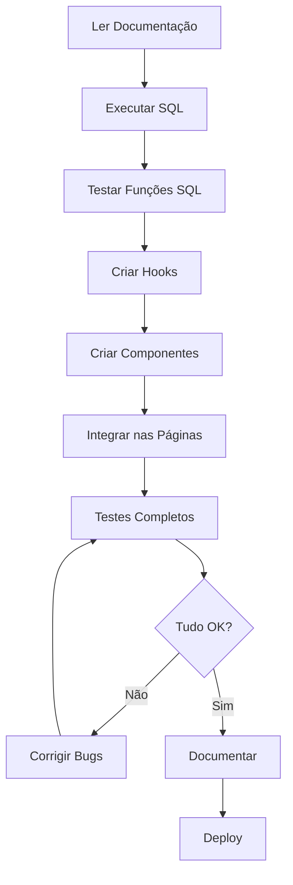

# Gestão Administrativa de Créditos - Especificação Completa

## 📋 Visão Geral

Esta especificação define a implementação de funcionalidades administrativas para o sistema de créditos pré-pagos (wallet), permitindo que administradores gerenciem carteiras de clientes com operações avançadas.

## 🎯 Objetivo

Adicionar ferramentas administrativas que permitam:
- ✅ Editar transações existentes
- ✅ Cancelar/estornar transações
- ✅ Ajustar saldo manualmente
- ✅ Excluir carteiras
- ✅ Gerar relatórios em PDF

## 📁 Estrutura de Arquivos

```
.kiro/specs/gestao-administrativa-creditos/
├── README.md                    # Este arquivo
├── requirements.md              # Requisitos detalhados (EARS + INCOSE)
├── design.md                    # Design técnico e arquitetura
├── tasks.md                     # Lista de tarefas de implementação
├── database-changes.sql         # Scripts SQL para alterações no banco
└── testing-guide.md            # Guia completo de testes
```

## 🚀 Como Usar Esta Spec

### 1. Leitura Recomendada

Leia os documentos nesta ordem:

1. **README.md** (este arquivo) - Visão geral
2. **requirements.md** - Entender os requisitos
3. **design.md** - Entender a arquitetura
4. **tasks.md** - Ver o plano de implementação
5. **database-changes.sql** - Revisar alterações no banco
6. **testing-guide.md** - Planejar testes

### 2. Antes de Começar

- [ ] Ler toda a documentação
- [ ] Entender o sistema atual de créditos
- [ ] Fazer backup do banco de dados
- [ ] Configurar ambiente de desenvolvimento

### 3. Implementação

Siga a ordem das tasks em `tasks.md`:

1. **Fase 1: Banco de Dados**
   - Executar `database-changes.sql` no Supabase
   - Validar que todas as alterações foram aplicadas
   - Testar funções SQL individualmente

2. **Fase 2: Backend/Hooks**
   - Criar hook `useWalletAdmin.ts`
   - Adicionar tipos TypeScript
   - Testar chamadas às funções SQL

3. **Fase 3: Componentes**
   - Criar modais de edição, cancelamento, ajuste, exclusão e PDF
   - Implementar validações no frontend
   - Adicionar feedback visual

4. **Fase 4: Integração**
   - Atualizar páginas existentes
   - Integrar novos componentes
   - Adicionar botões de ação

5. **Fase 5: Testes**
   - Executar todos os testes do `testing-guide.md`
   - Corrigir bugs encontrados
   - Validar integridade dos dados

6. **Fase 6: Documentação**
   - Atualizar documentação do usuário
   - Criar guia de uso para administradores
   - Adicionar screenshots

## 📊 Alterações no Banco de Dados

### Tabelas Modificadas

**wallet_transacoes** - Novos campos:
- `editado_em` (TIMESTAMP) - Data da última edição
- `editado_por` (TEXT) - Quem editou
- `cancelada` (BOOLEAN) - Se foi cancelada
- `motivo_cancelamento` (TEXT) - Motivo do cancelamento
- `valor_original` (NUMERIC) - Valor antes da edição

### Novas Funções SQL

1. **wallet_editar_transacao()** - Edita transação e atualiza saldo
2. **wallet_cancelar_transacao()** - Cancela transação e reverte saldo
3. **wallet_ajustar_saldo()** - Ajusta saldo manualmente
4. **wallet_deletar_carteira()** - Deleta carteira (apenas se saldo = 0)

## 🎨 Novos Componentes

### Frontend

1. **WalletTransacaoEditModal.tsx** - Modal para editar transações
2. **WalletTransacaoCancelModal.tsx** - Modal para cancelar transações
3. **WalletAjusteSaldoModal.tsx** - Modal para ajustar saldo
4. **WalletDeleteModal.tsx** - Modal para excluir carteira
5. **WalletPDFGenerator.tsx** - Gerador de relatórios em PDF

### Hooks

1. **useWalletAdmin.ts** - Hook com mutations para operações admin

## 🔒 Validações de Segurança

### Regras de Negócio

- ✅ Saldo nunca pode ficar negativo
- ✅ Transações canceladas não podem ser editadas
- ✅ Exclusão só é permitida com saldo zero
- ✅ Cancelamento e ajuste exigem motivo obrigatório
- ✅ Todas as operações são validadas no backend

### Integridade de Dados

- ✅ Transações em SQL para operações atômicas
- ✅ Validações duplicadas (frontend + backend)
- ✅ Rastreamento básico (quem fez, quando)
- ✅ Histórico preservado (transações não são deletadas ao cancelar)

## 📈 Métricas de Sucesso

### Funcionalidades

- [ ] Todas as 5 funcionalidades implementadas
- [ ] Todos os testes passando
- [ ] Zero bugs críticos
- [ ] Documentação completa

### Performance

- [ ] Operações completam em < 2 segundos
- [ ] PDF gerado em < 5 segundos
- [ ] Interface responsiva e fluida

### UX

- [ ] Feedback visual claro
- [ ] Mensagens de erro compreensíveis
- [ ] Confirmações para ações irreversíveis
- [ ] Loading states em todas as operações

## ⚠️ Pontos de Atenção

### Crítico

1. **Backup**: Sempre fazer backup antes de executar SQL em produção
2. **Testes**: Testar TODAS as funções SQL antes de usar no frontend
3. **Validações**: Nunca confiar apenas em validações do frontend
4. **Saldo**: Verificar integridade do saldo após cada operação

### Importante

1. **Motivos**: Sempre exigir motivo em cancelamentos e ajustes
2. **Confirmações**: Ações irreversíveis devem ter confirmação dupla
3. **Feedback**: Usuário deve sempre saber o resultado da operação
4. **Logs**: Manter registro de quem fez cada operação

## 🔄 Fluxo de Trabalho



## 📞 Suporte

### Dúvidas sobre Requisitos
Consultar: `requirements.md`

### Dúvidas sobre Implementação
Consultar: `design.md` e `tasks.md`

### Dúvidas sobre Banco de Dados
Consultar: `database-changes.sql`

### Dúvidas sobre Testes
Consultar: `testing-guide.md`

## 🎉 Próximos Passos

Após concluir esta spec:

1. ✅ Todas as funcionalidades administrativas estarão disponíveis
2. ✅ Sistema de créditos estará completo
3. ✅ Administradores terão controle total sobre carteiras
4. ✅ Relatórios em PDF disponíveis para clientes

### Melhorias Futuras (Fora do Escopo)

- Auditoria completa com tabela de logs
- Notificações automáticas para clientes
- Exportação em Excel
- Gráficos de uso ao longo do tempo
- Transferência entre carteiras
- Bloqueio/desbloqueio de carteiras

## 📝 Changelog

### Versão 1.0 (Atual)
- Especificação inicial criada
- Requisitos definidos (EARS + INCOSE)
- Design técnico completo
- Tasks detalhadas
- Scripts SQL prontos
- Guia de testes completo

---

**Status**: 📝 Documentação Completa - Pronto para Implementação

**Última Atualização**: 2025-01-13

**Autor**: Kiro AI Assistant

**Aprovação**: Aguardando aprovação do usuário
