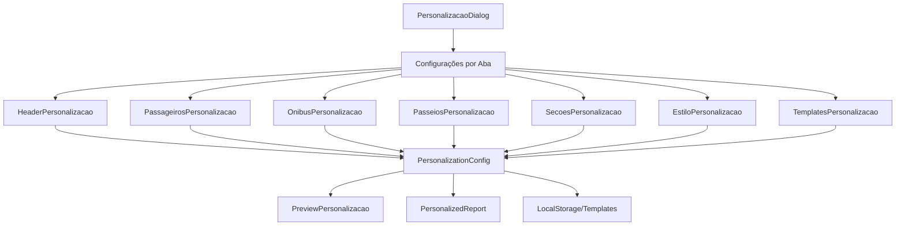

# Design: Sistema de Personalização Completa de Relatórios

## Overview

O sistema de personalização completa permitirá aos usuários configurar cada aspecto dos relatórios de viagem, desde o header até os dados específicos de cada seção. A solução será construída como uma extensão do sistema atual de filtros, mantendo compatibilidade com os filtros rápidos existentes.

## Architecture

### Estrutura de Componentes

```
src/components/relatorios/
├── personalizacao/
│   ├── PersonalizacaoDialog.tsx          # Dialog principal
│   ├── HeaderPersonalizacao.tsx          # Configuração do header
│   ├── PassageirosPersonalizacao.tsx     # Configuração da lista de passageiros
│   ├── OnibusPersonalizacao.tsx          # Configuração da lista de ônibus
│   ├── PasseiosPersonalizacao.tsx        # Configuração de dados de passeios
│   ├── SecoesPersonalizacao.tsx          # Configuração das seções de resumo
│   ├── EstiloPersonalizacao.tsx          # Configuração de formatação e estilo
│   ├── TemplatesPersonalizacao.tsx       # Gerenciamento de templates
│   └── PreviewPersonalizacao.tsx         # Preview em tempo real
├── ReportFilters.tsx                     # Componente existente (mantido)
└── PersonalizedReport.tsx                # Novo componente de relatório personalizado
```

### Fluxo de Dados



## Components and Interfaces

### 1. Tipos de Configuração

```typescript
// Configuração completa de personalização
export interface PersonalizationConfig {
  header: HeaderConfig;
  passageiros: PassageirosConfig;
  onibus: OnibusConfig;
  passeios: PasseiosConfig;
  secoes: SecoesConfig;
  estilo: EstiloConfig;
  metadata: ConfigMetadata;
}

// Configuração do Header
export interface HeaderConfig {
  dadosJogo: {
    mostrarAdversario: boolean;
    mostrarDataHora: boolean;
    mostrarLocalJogo: boolean;
    mostrarNomeEstadio: boolean;
  };
  dadosViagem: {
    mostrarStatus: boolean;
    mostrarValorPadrao: boolean;
    mostrarSetorPadrao: boolean;
    mostrarRota: boolean;
    mostrarTipoPagamento: boolean;
  };
  logos: {
    mostrarLogoEmpresa: boolean;
    mostrarLogoAdversario: boolean;
    mostrarLogoFlamengo: boolean;
    posicionamento: 'horizontal' | 'vertical' | 'personalizado';
  };
  empresa: {
    mostrarNome: boolean;
    mostrarTelefone: boolean;
    mostrarEmail: boolean;
    mostrarEndereco: boolean;
    mostrarSite: boolean;
    mostrarRedesSociais: boolean;
  };
  totais: {
    mostrarTotalIngressos: boolean;
    mostrarTotalPassageiros: boolean;
    mostrarTotalArrecadado: boolean;
    mostrarDataGeracao: boolean;
  };
  textoPersonalizado: {
    titulo?: string;
    subtitulo?: string;
    observacoes?: string;
    instrucoes?: string;
  };
}

// Configuração da Lista de Passageiros
export interface PassageirosConfig {
  colunas: PassageiroColumn[];
  ordenacao: {
    campo: keyof PassageiroDisplay;
    direcao: 'asc' | 'desc';
  };
  agrupamento: {
    ativo: boolean;
    campo?: 'onibus' | 'setor' | 'cidade' | 'status';
  };
}

export interface PassageiroColumn {
  id: keyof PassageiroDisplay;
  label: string;
  visivel: boolean;
  largura?: number;
  ordem: number;
  categoria: 'pessoais' | 'localizacao' | 'viagem' | 'financeiro' | 'passeios' | 'extras';
}

// Configuração da Lista de Ônibus
export interface OnibusConfig {
  dadosBasicos: {
    mostrarNumeroIdentificacao: boolean;
    mostrarTipoOnibus: boolean;
    mostrarEmpresa: boolean;
    mostrarCapacidade: boolean;
    mostrarLugaresExtras: boolean;
  };
  dadosTransfer: {
    mostrarNomeTour: boolean;
    mostrarRota: boolean;
    mostrarPlaca: boolean;
    mostrarMotorista: boolean;
  };
  dadosOcupacao: {
    mostrarTotalPassageiros: boolean;
    mostrarPassageirosConfirmados: boolean;
    mostrarVagasDisponiveis: boolean;
    mostrarTaxaOcupacao: boolean;
  };
  dadosTecnicos: {
    mostrarWifi: boolean;
    mostrarFoto: boolean;
    mostrarObservacoes: boolean;
  };
  exibicao: {
    mostrarListaPassageiros: boolean;
    paginaSeparadaPorOnibus: boolean;
  };
}

// Configuração de Passeios
export interface PasseiosConfig {
  tiposPasseios: {
    incluirPagos: boolean;
    incluirGratuitos: boolean;
    passeiosEspecificos: string[];
  };
  dadosPorPasseio: {
    mostrarNome: boolean;
    mostrarCategoria: boolean;
    mostrarValorCobrado: boolean;
    mostrarCustoOperacional: boolean;
  };
  estatisticas: {
    mostrarTotalParticipantes: boolean;
    mostrarReceitaPorPasseio: boolean;
    mostrarMargemLucro: boolean;
  };
  agrupamentos: {
    tipo: 'categoria' | 'valor' | 'popularidade' | 'nenhum';
  };
  exibicaoNaLista: {
    formato: 'coluna_separada' | 'texto_concatenado' | 'com_icones';
    mostrarStatus: boolean;
    mostrarValoresIndividuais: boolean;
  };
}

// Configuração das Seções
export interface SecoesConfig {
  secoes: SecaoConfig[];
  ordenacao: string[];
}

export interface SecaoConfig {
  id: string;
  titulo: string;
  visivel: boolean;
  ordem: number;
  configuracao: any; // Específico para cada tipo de seção
}

// Configuração de Estilo
export interface EstiloConfig {
  fontes: {
    tamanhoHeader: number;
    tamanhoTexto: number;
    tamanhoTabela: number;
    familia: string;
  };
  cores: {
    headerPrincipal: string;
    headerSecundario: string;
    textoNormal: string;
    destaque: string;
    linhasAlternadas: boolean;
    corLinhasAlternadas: string;
  };
  layout: {
    orientacao: 'retrato' | 'paisagem';
    margens: {
      superior: number;
      inferior: number;
      esquerda: number;
      direita: number;
    };
    espacamento: {
      entreSecoes: number;
      entreTabelas: number;
    };
    quebrasAutomaticas: boolean;
  };
  elementos: {
    bordas: boolean;
    separadores: boolean;
    marcaDagua?: string;
    logoFundo?: string;
  };
}

// Metadados da Configuração
export interface ConfigMetadata {
  nome: string;
  descricao?: string;
  categoria: string;
  criadoEm: string;
  atualizadoEm: string;
  versao: string;
  autor?: string;
}
```

### 2. Componente Principal de Personalização

```typescript
// PersonalizacaoDialog.tsx
export interface PersonalizacaoDialogProps {
  open: boolean;
  onOpenChange: (open: boolean) => void;
  configuracaoAtual: PersonalizationConfig;
  onConfiguracaoChange: (config: PersonalizationConfig) => void;
  passageiros: PassageiroDisplay[];
  onibusList: OnibusData[];
  passeios: Passeio[];
  viagem: Viagem;
}

export const PersonalizacaoDialog: React.FC<PersonalizacaoDialogProps> = ({
  open,
  onOpenChange,
  configuracaoAtual,
  onConfiguracaoChange,
  passageiros,
  onibusList,
  passeios,
  viagem
}) => {
  const [activeTab, setActiveTab] = useState<string>('header');
  const [previewData, setPreviewData] = useState<any>(null);

  // Atualizar preview em tempo real
  useEffect(() => {
    const preview = generatePreviewData(configuracaoAtual, passageiros, onibusList);
    setPreviewData(preview);
  }, [configuracaoAtual, passageiros, onibusList]);

  return (
    <Dialog open={open} onOpenChange={onOpenChange}>
      <DialogContent className="max-w-7xl max-h-[90vh] overflow-hidden">
        <div className="flex h-full">
          {/* Painel de Configuração */}
          <div className="w-1/2 border-r">
            <Tabs value={activeTab} onValueChange={setActiveTab}>
              <TabsList className="grid w-full grid-cols-4">
                <TabsTrigger value="header">📋 Header</TabsTrigger>
                <TabsTrigger value="passageiros">👥 Passageiros</TabsTrigger>
                <TabsTrigger value="onibus">🚌 Ônibus</TabsTrigger>
                <TabsTrigger value="passeios">🎠 Passeios</TabsTrigger>
              </TabsList>
              <TabsList className="grid w-full grid-cols-4 mt-2">
                <TabsTrigger value="secoes">📊 Seções</TabsTrigger>
                <TabsTrigger value="estilo">🎨 Estilo</TabsTrigger>
                <TabsTrigger value="templates">💾 Templates</TabsTrigger>
                <TabsTrigger value="preview">👁️ Preview</TabsTrigger>
              </TabsList>

              <div className="mt-4 h-[calc(100vh-200px)] overflow-y-auto">
                <TabsContent value="header">
                  <HeaderPersonalizacao
                    config={configuracaoAtual.header}
                    onChange={(header) => 
                      onConfiguracaoChange({...configuracaoAtual, header})
                    }
                    viagem={viagem}
                  />
                </TabsContent>

                <TabsContent value="passageiros">
                  <PassageirosPersonalizacao
                    config={configuracaoAtual.passageiros}
                    onChange={(passageiros) => 
                      onConfiguracaoChange({...configuracaoAtual, passageiros})
                    }
                    passageiros={passageiros}
                  />
                </TabsContent>

                {/* Outras abas... */}
              </div>
            </Tabs>
          </div>

          {/* Painel de Preview */}
          <div className="w-1/2 p-4">
            <PreviewPersonalizacao
              config={configuracaoAtual}
              previewData={previewData}
            />
          </div>
        </div>
      </DialogContent>
    </Dialog>
  );
};
```

### 3. Sistema de Templates

```typescript
// TemplatesPersonalizacao.tsx
export interface Template {
  id: string;
  nome: string;
  descricao?: string;
  categoria: 'oficial' | 'personalizado' | 'compartilhado';
  configuracao: PersonalizationConfig;
  metadata: ConfigMetadata;
}

export const TemplatesPersonalizacao: React.FC<{
  onTemplateSelect: (template: Template) => void;
  configuracaoAtual: PersonalizationConfig;
  onSalvarTemplate: (template: Omit<Template, 'id'>) => void;
}> = ({ onTemplateSelect, configuracaoAtual, onSalvarTemplate }) => {
  const [templates, setTemplates] = useState<Template[]>([]);
  const [categoriaFiltro, setCategoriaFiltro] = useState<string>('todos');

  // Templates oficiais predefinidos
  const templatesOficiais: Template[] = [
    {
      id: 'responsavel-onibus',
      nome: 'Lista para Responsável do Ônibus',
      categoria: 'oficial',
      configuracao: gerarConfigResponsavel(),
      metadata: {
        nome: 'Lista para Responsável do Ônibus',
        categoria: 'oficial',
        criadoEm: new Date().toISOString(),
        atualizadoEm: new Date().toISOString(),
        versao: '1.0'
      }
    },
    {
      id: 'lista-passageiros',
      nome: 'Lista para Passageiros',
      categoria: 'oficial',
      configuracao: gerarConfigPassageiros(),
      metadata: {
        nome: 'Lista para Passageiros',
        categoria: 'oficial',
        criadoEm: new Date().toISOString(),
        atualizadoEm: new Date().toISOString(),
        versao: '1.0'
      }
    },
    // ... outros templates oficiais
  ];

  return (
    <div className="space-y-6">
      {/* Filtros de Categoria */}
      <div className="flex gap-2">
        <Button
          variant={categoriaFiltro === 'todos' ? 'default' : 'outline'}
          onClick={() => setCategoriaFiltro('todos')}
        >
          Todos
        </Button>
        <Button
          variant={categoriaFiltro === 'oficial' ? 'default' : 'outline'}
          onClick={() => setCategoriaFiltro('oficial')}
        >
          Oficiais
        </Button>
        <Button
          variant={categoriaFiltro === 'personalizado' ? 'default' : 'outline'}
          onClick={() => setCategoriaFiltro('personalizado')}
        >
          Meus Templates
        </Button>
      </div>

      {/* Lista de Templates */}
      <div className="grid grid-cols-1 md:grid-cols-2 gap-4">
        {templates
          .filter(t => categoriaFiltro === 'todos' || t.categoria === categoriaFiltro)
          .map(template => (
            <Card key={template.id} className="cursor-pointer hover:shadow-md">
              <CardHeader>
                <CardTitle className="text-sm">{template.nome}</CardTitle>
                {template.descricao && (
                  <CardDescription>{template.descricao}</CardDescription>
                )}
              </CardHeader>
              <CardContent>
                <div className="flex justify-between items-center">
                  <Badge variant={template.categoria === 'oficial' ? 'default' : 'secondary'}>
                    {template.categoria}
                  </Badge>
                  <Button
                    size="sm"
                    onClick={() => onTemplateSelect(template)}
                  >
                    Aplicar
                  </Button>
                </div>
              </CardContent>
            </Card>
          ))}
      </div>

      {/* Salvar Template Atual */}
      <Card>
        <CardHeader>
          <CardTitle>Salvar Configuração Atual</CardTitle>
        </CardHeader>
        <CardContent>
          <SalvarTemplateForm
            configuracaoAtual={configuracaoAtual}
            onSalvar={onSalvarTemplate}
          />
        </CardContent>
      </Card>
    </div>
  );
};
```

## Data Models

### 1. Estrutura de Armazenamento Local

```typescript
// LocalStorage Schema
interface StoredPersonalizationData {
  templates: Template[];
  configuracaoAtual: PersonalizationConfig;
  historico: ConfigHistoryItem[];
  preferencias: UserPreferences;
}

interface ConfigHistoryItem {
  id: string;
  configuracao: PersonalizationConfig;
  timestamp: string;
  acao: 'criado' | 'modificado' | 'aplicado';
}

interface UserPreferences {
  templatePadrao?: string;
  autoSalvarConfiguracoes: boolean;
  mostrarPreviewAutomatico: boolean;
  categoriaTemplatePreferida: string;
}
```

### 2. Configurações Padrão

```typescript
// Configurações padrão para diferentes cenários
export const DEFAULT_CONFIGS = {
  completo: (): PersonalizationConfig => ({
    header: {
      dadosJogo: {
        mostrarAdversario: true,
        mostrarDataHora: true,
        mostrarLocalJogo: true,
        mostrarNomeEstadio: true,
      },
      dadosViagem: {
        mostrarStatus: true,
        mostrarValorPadrao: true,
        mostrarSetorPadrao: true,
        mostrarRota: false,
        mostrarTipoPagamento: false,
      },
      logos: {
        mostrarLogoEmpresa: true,
        mostrarLogoAdversario: true,
        mostrarLogoFlamengo: true,
        posicionamento: 'horizontal',
      },
      empresa: {
        mostrarNome: true,
        mostrarTelefone: true,
        mostrarEmail: true,
        mostrarEndereco: false,
        mostrarSite: false,
        mostrarRedesSociais: false,
      },
      totais: {
        mostrarTotalIngressos: true,
        mostrarTotalPassageiros: true,
        mostrarTotalArrecadado: true,
        mostrarDataGeracao: true,
      },
      textoPersonalizado: {},
    },
    passageiros: {
      colunas: gerarColunasPassageirosPadrao(),
      ordenacao: {
        campo: 'nome',
        direcao: 'asc',
      },
      agrupamento: {
        ativo: false,
      },
    },
    // ... outras configurações
  }),

  responsavel: (): PersonalizationConfig => ({
    // Configuração específica para responsável de ônibus
    // Remove informações financeiras, foca em dados operacionais
  }),

  passageiros: (): PersonalizationConfig => ({
    // Configuração específica para lista de passageiros
    // Layout simplificado, informações essenciais
  }),

  // ... outros presets
};
```

## Error Handling

### 1. Validação de Configurações

```typescript
export class PersonalizationValidator {
  static validate(config: PersonalizationConfig): ValidationResult {
    const errors: ValidationError[] = [];
    const warnings: ValidationWarning[] = [];

    // Validar header
    if (!config.header.dadosJogo.mostrarAdversario && !config.header.textoPersonalizado.titulo) {
      warnings.push({
        campo: 'header.titulo',
        mensagem: 'Recomendamos mostrar o adversário ou definir um título personalizado'
      });
    }

    // Validar colunas de passageiros
    const colunasVisiveis = config.passageiros.colunas.filter(c => c.visivel);
    if (colunasVisiveis.length === 0) {
      errors.push({
        campo: 'passageiros.colunas',
        mensagem: 'Pelo menos uma coluna deve estar visível na lista de passageiros'
      });
    }

    // Validar larguras de colunas
    const larguraTotal = colunasVisiveis.reduce((sum, col) => sum + (col.largura || 100), 0);
    if (larguraTotal > 1000) {
      warnings.push({
        campo: 'passageiros.larguras',
        mensagem: 'A largura total das colunas pode causar problemas de layout'
      });
    }

    return {
      valido: errors.length === 0,
      errors,
      warnings
    };
  }

  static sanitize(config: PersonalizationConfig): PersonalizationConfig {
    // Limpar e corrigir configurações inválidas
    const sanitized = { ...config };

    // Garantir que pelo menos uma coluna esteja visível
    if (sanitized.passageiros.colunas.every(c => !c.visivel)) {
      sanitized.passageiros.colunas[0].visivel = true;
    }

    // Corrigir ordens duplicadas
    sanitized.passageiros.colunas.forEach((col, index) => {
      col.ordem = index;
    });

    return sanitized;
  }
}
```

### 2. Tratamento de Erros de Renderização

```typescript
export const PersonalizedReportErrorBoundary: React.FC<{
  children: React.ReactNode;
  fallback?: React.ComponentType<{ error: Error; reset: () => void }>;
}> = ({ children, fallback: Fallback }) => {
  return (
    <ErrorBoundary
      FallbackComponent={Fallback || DefaultErrorFallback}
      onError={(error, errorInfo) => {
        console.error('Erro na renderização do relatório personalizado:', error);
        // Log para monitoramento
        logError('personalized-report-render', error, errorInfo);
      }}
    >
      {children}
    </ErrorBoundary>
  );
};

const DefaultErrorFallback: React.FC<{ error: Error; resetErrorBoundary: () => void }> = ({
  error,
  resetErrorBoundary
}) => (
  <div className="p-8 text-center">
    <h2 className="text-xl font-semibold text-red-600 mb-4">
      Erro na Personalização do Relatório
    </h2>
    <p className="text-gray-600 mb-4">
      Ocorreu um erro ao aplicar as configurações personalizadas.
    </p>
    <div className="space-x-4">
      <Button onClick={resetErrorBoundary}>
        Tentar Novamente
      </Button>
      <Button variant="outline" onClick={() => window.location.reload()}>
        Recarregar Página
      </Button>
    </div>
  </div>
);
```

## Testing Strategy

### 1. Testes de Componentes

```typescript
// PersonalizacaoDialog.test.tsx
describe('PersonalizacaoDialog', () => {
  const mockProps = {
    open: true,
    onOpenChange: jest.fn(),
    configuracaoAtual: DEFAULT_CONFIGS.completo(),
    onConfiguracaoChange: jest.fn(),
    passageiros: mockPassageiros,
    onibusList: mockOnibus,
    passeios: mockPasseios,
    viagem: mockViagem
  };

  test('deve renderizar todas as abas de personalização', () => {
    render(<PersonalizacaoDialog {...mockProps} />);
    
    expect(screen.getByText('📋 Header')).toBeInTheDocument();
    expect(screen.getByText('👥 Passageiros')).toBeInTheDocument();
    expect(screen.getByText('🚌 Ônibus')).toBeInTheDocument();
    expect(screen.getByText('🎠 Passeios')).toBeInTheDocument();
    expect(screen.getByText('📊 Seções')).toBeInTheDocument();
    expect(screen.getByText('🎨 Estilo')).toBeInTheDocument();
    expect(screen.getByText('💾 Templates')).toBeInTheDocument();
  });

  test('deve atualizar preview em tempo real', async () => {
    render(<PersonalizacaoDialog {...mockProps} />);
    
    // Alterar configuração
    const checkbox = screen.getByLabelText('Mostrar Adversário');
    fireEvent.click(checkbox);
    
    // Verificar se onConfiguracaoChange foi chamado
    await waitFor(() => {
      expect(mockProps.onConfiguracaoChange).toHaveBeenCalled();
    });
  });

  test('deve validar configurações antes de aplicar', async () => {
    const invalidConfig = {
      ...DEFAULT_CONFIGS.completo(),
      passageiros: {
        ...DEFAULT_CONFIGS.completo().passageiros,
        colunas: DEFAULT_CONFIGS.completo().passageiros.colunas.map(c => ({
          ...c,
          visivel: false
        }))
      }
    };

    render(<PersonalizacaoDialog {...mockProps} configuracaoAtual={invalidConfig} />);
    
    const aplicarButton = screen.getByText('Aplicar');
    fireEvent.click(aplicarButton);
    
    // Deve mostrar erro de validação
    await waitFor(() => {
      expect(screen.getByText(/pelo menos uma coluna deve estar visível/i)).toBeInTheDocument();
    });
  });
});
```

### 2. Testes de Integração

```typescript
// PersonalizationIntegration.test.tsx
describe('Integração de Personalização', () => {
  test('deve salvar e carregar template corretamente', async () => {
    const { user } = setup(<PersonalizacaoDialog {...mockProps} />);
    
    // Modificar configuração
    await user.click(screen.getByLabelText('Mostrar Telefone'));
    
    // Salvar como template
    await user.click(screen.getByText('💾 Templates'));
    await user.type(screen.getByLabelText('Nome do Template'), 'Meu Template');
    await user.click(screen.getByText('Salvar'));
    
    // Verificar se foi salvo no localStorage
    const stored = JSON.parse(localStorage.getItem('personalization-data') || '{}');
    expect(stored.templates).toHaveLength(1);
    expect(stored.templates[0].nome).toBe('Meu Template');
  });

  test('deve exportar e importar configuração', async () => {
    const config = DEFAULT_CONFIGS.completo();
    
    // Exportar
    const exported = PersonalizationExporter.export(config);
    expect(exported).toContain('personalization-config');
    
    // Importar
    const imported = PersonalizationExporter.import(exported);
    expect(imported).toEqual(config);
  });
});
```

### 3. Testes de Performance

```typescript
// Performance.test.tsx
describe('Performance da Personalização', () => {
  test('deve renderizar preview rapidamente com muitos passageiros', async () => {
    const muitosPassageiros = Array.from({ length: 1000 }, (_, i) => ({
      ...mockPassageiro,
      id: `passageiro-${i}`,
      nome: `Passageiro ${i}`
    }));

    const startTime = performance.now();
    
    render(
      <PreviewPersonalizacao
        config={DEFAULT_CONFIGS.completo()}
        previewData={{ passageiros: muitosPassageiros }}
      />
    );
    
    const endTime = performance.now();
    const renderTime = endTime - startTime;
    
    // Deve renderizar em menos de 2 segundos
    expect(renderTime).toBeLessThan(2000);
  });

  test('deve atualizar configuração sem lag', async () => {
    const { user } = setup(<PersonalizacaoDialog {...mockProps} />);
    
    const startTime = performance.now();
    
    // Fazer múltiplas alterações rapidamente
    for (let i = 0; i < 10; i++) {
      await user.click(screen.getByLabelText('Mostrar Telefone'));
      await user.click(screen.getByLabelText('Mostrar Telefone'));
    }
    
    const endTime = performance.now();
    const updateTime = endTime - startTime;
    
    // Deve atualizar em menos de 1 segundo
    expect(updateTime).toBeLessThan(1000);
  });
});
```

## Considerações de Implementação

### 1. Compatibilidade com Sistema Atual

- Manter todos os filtros rápidos existentes funcionando
- Permitir migração gradual dos usuários para o novo sistema
- Preservar URLs compartilháveis existentes

### 2. Performance

- Implementar virtualização para listas grandes de passageiros
- Usar React.memo para componentes de configuração
- Debounce para atualizações de preview em tempo real
- Lazy loading para templates não utilizados

### 3. Acessibilidade

- Suporte completo a navegação por teclado
- Labels apropriados para screen readers
- Contraste adequado em todos os elementos
- Indicadores visuais claros para configurações ativas

### 4. Responsividade

- Layout adaptável para diferentes tamanhos de tela
- Preview otimizado para dispositivos móveis
- Configurações simplificadas em telas pequenas