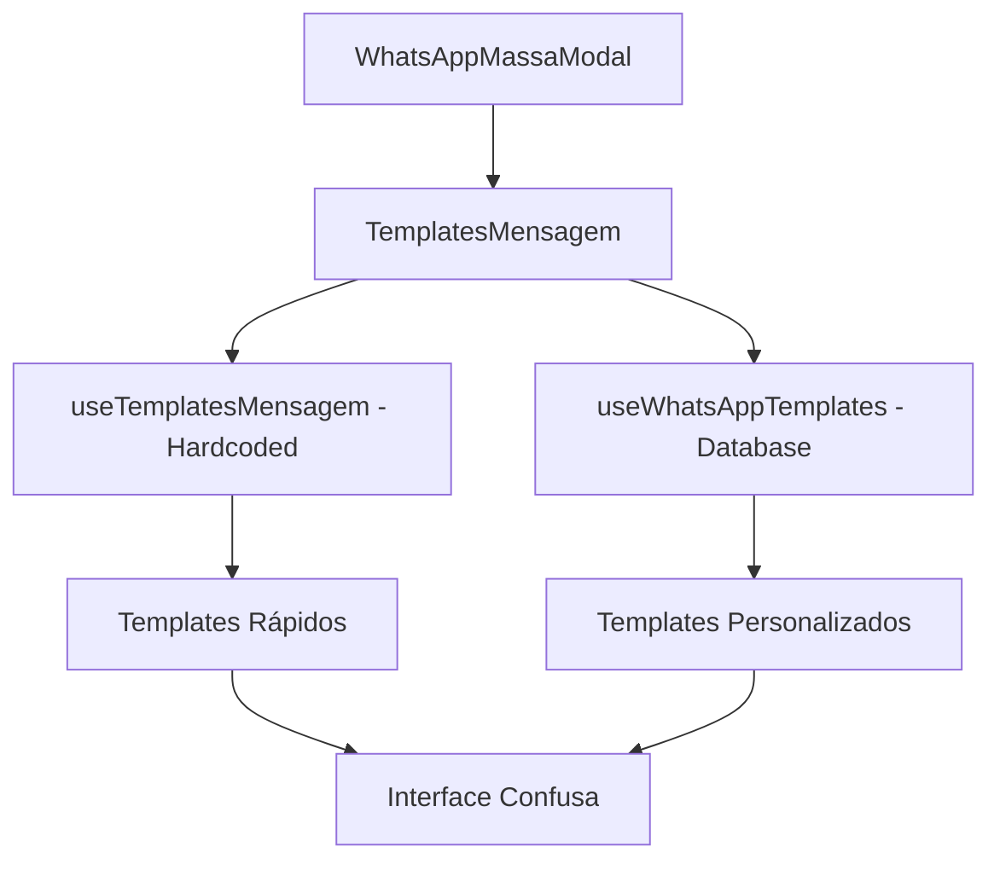
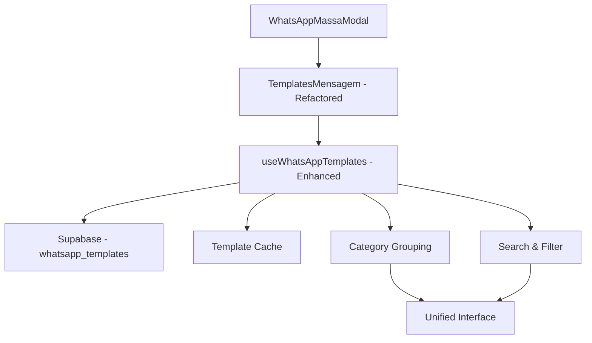
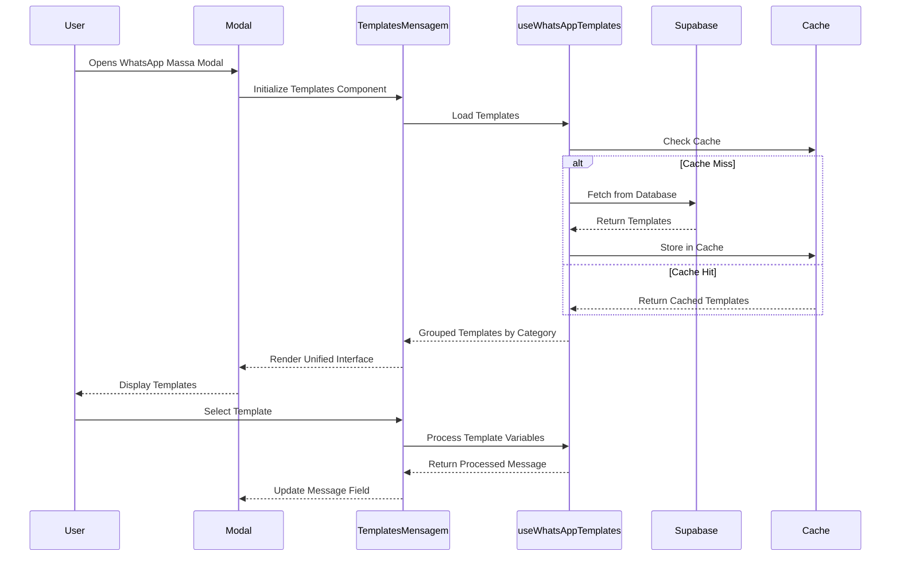

# Design Document - Reformular WhatsApp Massa para Usar Apenas Templates do Banco

## Overview

Este documento detalha a arquitetura técnica para reformular o sistema de WhatsApp em massa, removendo os templates rápidos hardcoded e utilizando exclusivamente os templates cadastrados no banco de dados. A solução visa simplificar a interface, melhorar a manutenibilidade e dar controle total aos administradores sobre os templates disponíveis.

## Architecture

### Current Architecture (To Be Removed)


### New Architecture (Target)


### Data Flow


## Components and Interfaces

### 1. Enhanced TemplatesMensagem Component

**File:** `src/components/whatsapp-massa/TemplatesMensagem.tsx`

```typescript
interface TemplatesMensagemProps {
  mensagem: string;
  onMensagemChange: (mensagem: string) => void;
  dadosViagem?: ViagemData;
}

interface TemplateGroup {
  categoria: string;
  emoji: string;
  templates: WhatsAppTemplate[];
  count: number;
}

interface TemplateSearchState {
  query: string;
  selectedCategory: string | null;
  filteredTemplates: WhatsAppTemplate[];
}
```

**Key Features:**
- Single unified template section
- Category-based grouping
- Search and filter functionality
- Template preview with variable substitution
- Loading states and error handling
- Empty state management

### 2. Enhanced useWhatsAppTemplates Hook

**File:** `src/hooks/useWhatsAppTemplates.ts`

```typescript
interface EnhancedUseWhatsAppTemplatesReturn extends UseWhatsAppTemplatesReturn {
  // New methods for the refactored system
  getTemplatesByCategory: () => Record<string, WhatsAppTemplate[]>;
  searchTemplates: (query: string) => WhatsAppTemplate[];
  getTemplatePreview: (template: WhatsAppTemplate, dadosViagem: ViagemData) => string;
  getCategoryStats: () => Record<string, number>;
  
  // Enhanced caching
  cacheStatus: 'loading' | 'fresh' | 'stale' | 'error';
  lastUpdated: Date | null;
  refreshCache: () => Promise<void>;
}
```

**New Functionality:**
- Intelligent caching with TTL
- Category grouping and statistics
- Real-time search filtering
- Template preview generation
- Performance optimizations

### 3. Template Search Component

**File:** `src/components/whatsapp-massa/TemplateSearch.tsx`

```typescript
interface TemplateSearchProps {
  onSearch: (query: string) => void;
  onCategoryFilter: (category: string | null) => void;
  categories: string[];
  currentQuery: string;
  currentCategory: string | null;
}
```

### 4. Template Category Group Component

**File:** `src/components/whatsapp-massa/TemplateCategoryGroup.tsx`

```typescript
interface TemplateCategoryGroupProps {
  categoria: string;
  emoji: string;
  templates: WhatsAppTemplate[];
  onTemplateSelect: (template: WhatsAppTemplate) => void;
  dadosViagem: ViagemData;
}
```

### 5. Empty State Component

**File:** `src/components/whatsapp-massa/TemplatesEmptyState.tsx`

```typescript
interface TemplatesEmptyStateProps {
  hasSearchQuery: boolean;
  onCreateTemplate?: () => void;
  onClearSearch?: () => void;
}
```

## Data Models

### Enhanced WhatsApp Template Model

```typescript
interface WhatsAppTemplate {
  id: string;
  nome: string;
  mensagem: string;
  categoria: 'confirmacao' | 'pagamento' | 'embarque' | 'pos-jogo' | 'geral' | 'convite';
  ativo: boolean;
  variaveis: TemplateVariable[];
  created_at: string;
  updated_at: string;
  
  // New fields for enhanced functionality
  uso_count?: number;          // Usage statistics
  ultima_utilizacao?: string;  // Last used timestamp
  favorito?: boolean;          // User favorite flag
  tags?: string[];            // Searchable tags
}
```

### Template Cache Model

```typescript
interface TemplateCache {
  templates: WhatsAppTemplate[];
  categorizedTemplates: Record<string, WhatsAppTemplate[]>;
  lastFetch: Date;
  ttl: number; // Time to live in milliseconds
  version: string;
}
```

### Search State Model

```typescript
interface TemplateSearchState {
  query: string;
  selectedCategory: string | null;
  filteredTemplates: WhatsAppTemplate[];
  isSearching: boolean;
  searchResults: {
    total: number;
    byCategory: Record<string, number>;
  };
}
```

## Error Handling

### Error Types and Handling Strategy

```typescript
enum TemplateErrorType {
  FETCH_ERROR = 'FETCH_ERROR',
  CACHE_ERROR = 'CACHE_ERROR',
  PROCESSING_ERROR = 'PROCESSING_ERROR',
  VALIDATION_ERROR = 'VALIDATION_ERROR'
}

interface TemplateError {
  type: TemplateErrorType;
  message: string;
  details?: any;
  recoverable: boolean;
}
```

### Error Recovery Mechanisms

1. **Network Errors:** Retry with exponential backoff
2. **Cache Errors:** Fallback to direct database fetch
3. **Processing Errors:** Show template with unprocessed variables
4. **Validation Errors:** Highlight problematic templates

### User-Friendly Error Messages

```typescript
const ERROR_MESSAGES = {
  FETCH_ERROR: 'Erro ao carregar templates. Tentando novamente...',
  CACHE_ERROR: 'Problema no cache. Carregando dados atualizados...',
  PROCESSING_ERROR: 'Erro ao processar template. Verifique as variáveis.',
  VALIDATION_ERROR: 'Template inválido. Contate o administrador.',
  NO_TEMPLATES: 'Nenhum template encontrado. Crie seu primeiro template!',
  SEARCH_NO_RESULTS: 'Nenhum template encontra para "{query}". Tente outros termos.'
};
```

## Testing Strategy

### Unit Tests

**File:** `src/components/whatsapp-massa/__tests__/TemplatesMensagem.test.tsx`

```typescript
describe('TemplatesMensagem - Refactored', () => {
  test('should load templates from database only', () => {
    // Test that hardcoded templates are not loaded
  });
  
  test('should group templates by category', () => {
    // Test category grouping functionality
  });
  
  test('should filter templates by search query', () => {
    // Test search functionality
  });
  
  test('should handle empty state gracefully', () => {
    // Test empty state display
  });
  
  test('should process template variables correctly', () => {
    // Test variable substitution
  });
});
```

### Integration Tests

**File:** `src/hooks/__tests__/useWhatsAppTemplates.integration.test.ts`

```typescript
describe('useWhatsAppTemplates - Enhanced', () => {
  test('should cache templates correctly', () => {
    // Test caching mechanism
  });
  
  test('should refresh cache when needed', () => {
    // Test cache invalidation
  });
  
  test('should handle database errors gracefully', () => {
    // Test error handling
  });
});
```

### E2E Tests

**File:** `cypress/e2e/whatsapp-massa-templates.cy.ts`

```typescript
describe('WhatsApp Massa - Templates Only from Database', () => {
  it('should show only database templates', () => {
    // Test complete user flow
  });
  
  it('should search and filter templates', () => {
    // Test search functionality
  });
  
  it('should apply template correctly', () => {
    // Test template application
  });
});
```

## Performance Considerations

### Caching Strategy

```typescript
const CACHE_CONFIG = {
  TTL: 5 * 60 * 1000, // 5 minutes
  MAX_SIZE: 100, // Maximum templates in cache
  REFRESH_THRESHOLD: 0.8 // Refresh when 80% of TTL elapsed
};
```

### Optimization Techniques

1. **Lazy Loading:** Load templates only when modal opens
2. **Memoization:** Cache processed templates and search results
3. **Debounced Search:** Prevent excessive API calls during typing
4. **Virtual Scrolling:** Handle large numbers of templates efficiently

### Bundle Size Impact

- **Removed:** `useTemplatesMensagem` hook (~2KB)
- **Removed:** Hardcoded templates data (~3KB)
- **Added:** Enhanced search functionality (~1KB)
- **Net Reduction:** ~4KB in bundle size

## Migration Strategy

### Phase 1: Preparation
1. Ensure all necessary templates exist in database
2. Add missing categories if needed
3. Test database connectivity and performance

### Phase 2: Code Refactoring
1. Update `TemplatesMensagem` component
2. Enhance `useWhatsAppTemplates` hook
3. Remove `useTemplatesMensagem` dependency

### Phase 3: Testing and Validation
1. Run comprehensive test suite
2. Validate all existing functionality works
3. Test with real data and edge cases

### Phase 4: Deployment
1. Deploy with feature flag (if available)
2. Monitor performance and error rates
3. Gradual rollout to all users

## Rollback Plan

### Immediate Rollback
- Keep `useTemplatesMensagem` hook as backup
- Feature flag to switch between old/new system
- Database rollback scripts if needed

### Rollback Triggers
- Error rate > 5%
- Performance degradation > 20%
- User complaints about missing functionality

## Security Considerations

### Template Content Validation
- Sanitize template content before display
- Validate variable substitution to prevent XSS
- Limit template size and complexity

### Access Control
- Ensure proper RLS policies on `whatsapp_templates` table
- Validate user permissions before template operations
- Audit template usage and modifications

## Monitoring and Analytics

### Key Metrics
- Template load time
- Search response time
- Template usage statistics
- Error rates by template
- User satisfaction scores

### Logging Strategy
```typescript
const TEMPLATE_EVENTS = {
  TEMPLATES_LOADED: 'templates_loaded',
  TEMPLATE_SELECTED: 'template_selected',
  SEARCH_PERFORMED: 'search_performed',
  ERROR_OCCURRED: 'error_occurred'
};
```

## Future Enhancements

### Phase 2 Features
1. **Template Analytics:** Usage statistics and popular templates
2. **Template Versioning:** Track template changes over time
3. **Template Sharing:** Share templates between organizations
4. **AI Suggestions:** Suggest templates based on context

### Phase 3 Features
1. **Template Builder:** Visual template creation interface
2. **A/B Testing:** Test different template versions
3. **Personalization:** User-specific template recommendations
4. **Integration:** Connect with external template libraries