# Design Document - WhatsApp em Massa para Viagens

## Overview

O sistema de WhatsApp em Massa será implementado como um modal acessível através da página de detalhes da viagem. A interface será simples e intuitiva, focando na facilidade de uso para gerar listas de contatos que podem ser utilizadas no WhatsApp Business para envio em massa real.

A arquitetura seguirá os padrões já estabelecidos no projeto, utilizando componentes React com TypeScript, shadcn/ui para interface, e integração com o banco Supabase existente.

## Architecture

### Componentes Principais

```
DetalhesViagem.tsx
├── WhatsAppMassaButton (novo)
└── WhatsAppMassaModal (novo)
    ├── FiltroPassageiros (novo)
    ├── CampoMensagem (novo)
    ├── PreviewMensagem (novo)
    ├── EstatisticasPassageiros (novo)
    └── GerarListaContatos (novo)
        ├── ListaNumeros (novo)
        └── DownloadVCF (novo)
```

### Fluxo de Dados

```mermaid
graph TD
    A[DetalhesViagem] --> B[WhatsAppMassaButton]
    B --> C[WhatsAppMassaModal]
    C --> D[usePassageirosWhatsApp Hook]
    D --> E[Filtrar Passageiros]
    E --> F[Gerar Lista/VCF]
    F --> G[Registrar Histórico]
    G --> H[Supabase]
```



## Components and Interfaces

### 1. WhatsAppMassaButton

**Localização:** Página DetalhesViagem.tsx, próximo aos botões de ação existentes

```typescript
interface WhatsAppMassaButtonProps {
  viagemId: string;
  passageiros: Passageiro[];
  onibusList: Onibus[];
}

const WhatsAppMassaButton: React.FC<WhatsAppMassaButtonProps> = ({
  viagemId,
  passageiros,
  onibusList
}) => {
  const passageirosComTelefone = passageiros.filter(p => p.telefone);
  const isDisabled = passageirosComTelefone.length === 0;
  
  return (
    <Button
      onClick={() => setModalOpen(true)}
      disabled={isDisabled}
      className="bg-green-600 hover:bg-green-700"
      title={isDisabled ? 'Nenhum passageiro com telefone cadastrado' : 'Enviar WhatsApp em massa'}
    >
      <MessageCircle className="h-4 w-4 mr-2" />
      WhatsApp em Massa ({passageirosComTelefone.length})
    </Button>
  );
};
```

### 2. WhatsAppMassaModal

**Interface Principal:** Modal responsivo com layout em duas colunas

```typescript
interface WhatsAppMassaModalProps {
  open: boolean;
  onOpenChange: (open: boolean) => void;
  viagemId: string;
  viagem: Viagem;
  passageiros: Passageiro[];
  onibusList: Onibus[];
}

const WhatsAppMassaModal: React.FC<WhatsAppMassaModalProps> = ({
  open,
  onOpenChange,
  viagemId,
  viagem,
  passageiros,
  onibusList
}) => {
  const [filtroOnibus, setFiltroOnibus] = useState<string>('todos');
  const [mensagem, setMensagem] = useState<string>('');
  const [modoExibicao, setModoExibicao] = useState<'numeros' | 'vcf'>('numeros');
  
  const { 
    passageirosFiltrados, 
    gerarListaNumeros, 
    gerarArquivoVCF,
    registrarHistorico 
  } = usePassageirosWhatsApp(passageiros, filtroOnibus, viagemId);
  
  return (
    <Dialog open={open} onOpenChange={onOpenChange}>
      <DialogContent className="max-w-5xl max-h-[90vh] overflow-y-auto">
        <DialogHeader>
          <DialogTitle className="flex items-center gap-2">
            <MessageCircle className="h-5 w-5 text-green-600" />
            WhatsApp em Massa - {viagem.adversario}
          </DialogTitle>
          <DialogDescription>
            Gere listas de contatos para usar no WhatsApp Business
          </DialogDescription>
        </DialogHeader>
        
        <div className="grid grid-cols-1 lg:grid-cols-2 gap-6">
          {/* Coluna Esquerda - Configuração */}
          <div className="space-y-4">
            <FiltroPassageiros 
              onibusList={onibusList}
              filtroAtual={filtroOnibus}
              onFiltroChange={setFiltroOnibus}
            />
            
            <CampoMensagem 
              mensagem={mensagem}
              onMensagemChange={setMensagem}
            />
            
            <PreviewMensagem mensagem={mensagem} />
          </div>
          
          {/* Coluna Direita - Lista e Ações */}
          <div className="space-y-4">
            <EstatisticasPassageiros 
              passageirosFiltrados={passageirosFiltrados}
              totalPassageiros={passageiros.length}
            />
            
            <GerarListaContatos
              passageiros={passageirosFiltrados}
              mensagem={mensagem}
              modoExibicao={modoExibicao}
              onModoChange={setModoExibicao}
              onGerarLista={gerarListaNumeros}
              onBaixarVCF={gerarArquivoVCF}
              onRegistrarHistorico={registrarHistorico}
            />
          </div>
        </div>
      </DialogContent>
    </Dialog>
  );
};
```

### 3. FiltroPassageiros

**Funcionalidade:** Seletor simples entre "Todos" e ônibus específicos

```typescript
interface FiltroPassageirosProps {
  onibusList: Onibus[];
  filtroAtual: string;
  onFiltroChange: (filtro: string) => void;
}

const FiltroPassageiros: React.FC<FiltroPassageirosProps> = ({
  onibusList,
  filtroAtual,
  onFiltroChange
}) => {
  return (
    <div className="space-y-2">
      <Label className="text-sm font-medium">Destinatários:</Label>
      <Select value={filtroAtual} onValueChange={onFiltroChange}>
        <SelectTrigger>
          <SelectValue placeholder="Selecionar passageiros" />
        </SelectTrigger>
        <SelectContent>
          <SelectItem value="todos">
            👥 Todos os passageiros
          </SelectItem>
          {onibusList.map(onibus => (
            <SelectItem key={onibus.id} value={onibus.id}>
              🚌 {onibus.numero_identificacao || `${onibus.tipo_onibus} - ${onibus.empresa}`}
            </SelectItem>
          ))}
        </SelectContent>
      </Select>
    </div>
  );
};
```

### 4. CampoMensagem

**Funcionalidade:** Textarea amplo para mensagem livre

```typescript
interface CampoMensagemProps {
  mensagem: string;
  onMensagemChange: (mensagem: string) => void;
}

const CampoMensagem: React.FC<CampoMensagemProps> = ({
  mensagem,
  onMensagemChange
}) => {
  const caracteresCount = mensagem.length;
  const maxCaracteres = 1000; // Limite sugerido
  
  return (
    <div className="space-y-2">
      <div className="flex justify-between items-center">
        <Label className="text-sm font-medium">Mensagem:</Label>
        <span className={`text-xs ${
          caracteresCount > maxCaracteres ? 'text-red-500' : 'text-gray-500'
        }`}>
          {caracteresCount}/{maxCaracteres}
        </span>
      </div>
      <Textarea
        placeholder="Digite sua mensagem personalizada aqui..."
        value={mensagem}
        onChange={(e) => onMensagemChange(e.target.value)}
        className="min-h-[120px] resize-none"
        maxLength={maxCaracteres}
      />
      <p className="text-xs text-gray-500">
        💡 Dica: Mantenha a mensagem clara e objetiva para melhor comunicação
      </p>
    </div>
  );
};
```

### 5. PreviewMensagem

**Funcionalidade:** Simulação visual da mensagem no WhatsApp

```typescript
interface PreviewMensagemProps {
  mensagem: string;
}

const PreviewMensagem: React.FC<PreviewMensagemProps> = ({ mensagem }) => {
  return (
    <div className="space-y-2">
      <Label className="text-sm font-medium">Preview:</Label>
      <div className="bg-gray-50 rounded-lg p-3 border">
        <div className="bg-green-500 text-white rounded-lg p-3 max-w-[80%] ml-auto">
          <div className="text-sm whitespace-pre-wrap">
            {mensagem || 'Sua mensagem aparecerá aqui...'}
          </div>
          <div className="text-xs opacity-75 mt-1 text-right">
            {new Date().toLocaleTimeString('pt-BR', { 
              hour: '2-digit', 
              minute: '2-digit' 
            })} ✓✓
          </div>
        </div>
      </div>
    </div>
  );
};
```

### 6. EstatisticasPassageiros

**Funcionalidade:** Cards com informações dos passageiros selecionados

```typescript
interface EstatisticasPassageirosProps {
  passageirosFiltrados: Passageiro[];
  totalPassageiros: number;
}

const EstatisticasPassageiros: React.FC<EstatisticasPassageirosProps> = ({
  passageirosFiltrados,
  totalPassageiros
}) => {
  const comTelefone = passageirosFiltrados.filter(p => p.telefone).length;
  const semTelefone = passageirosFiltrados.length - comTelefone;
  
  return (
    <div className="space-y-3">
      <Label className="text-sm font-medium">Estatísticas:</Label>
      
      <div className="grid grid-cols-2 gap-3">
        <Card className="p-3">
          <div className="text-center">
            <div className="text-2xl font-bold text-green-600">{comTelefone}</div>
            <div className="text-xs text-gray-600">Com WhatsApp</div>
          </div>
        </Card>
        
        <Card className="p-3">
          <div className="text-center">
            <div className="text-2xl font-bold text-gray-400">{semTelefone}</div>
            <div className="text-xs text-gray-600">Sem telefone</div>
          </div>
        </Card>
      </div>
      
      {semTelefone > 0 && (
        <Alert>
          <AlertCircle className="h-4 w-4" />
          <AlertDescription className="text-sm">
            {semTelefone} passageiro{semTelefone > 1 ? 's' : ''} sem telefone será{semTelefone > 1 ? 'ão' : ''} excluído{semTelefone > 1 ? 's' : ''} da lista
          </AlertDescription>
        </Alert>
      )}
    </div>
  );
};
```

### 7. GerarListaContatos

**Funcionalidade:** Tabs para lista de números e download VCF

```typescript
interface GerarListaContatosProps {
  passageiros: Passageiro[];
  mensagem: string;
  modoExibicao: 'numeros' | 'vcf';
  onModoChange: (modo: 'numeros' | 'vcf') => void;
  onGerarLista: () => string;
  onBaixarVCF: () => void;
  onRegistrarHistorico: (tipo: string, quantidade: number) => void;
}

const GerarListaContatos: React.FC<GerarListaContatosProps> = ({
  passageiros,
  mensagem,
  modoExibicao,
  onModoChange,
  onGerarLista,
  onBaixarVCF,
  onRegistrarHistorico
}) => {
  const passageirosComTelefone = passageiros.filter(p => p.telefone);
  const isDisabled = !mensagem.trim() || passageirosComTelefone.length === 0;
  
  const handleCopiarLista = async () => {
    const lista = onGerarLista();
    await navigator.clipboard.writeText(lista);
    toast.success(`${passageirosComTelefone.length} números copiados!`);
    onRegistrarHistorico('lista_copiada', passageirosComTelefone.length);
  };
  
  const handleBaixarVCF = () => {
    onBaixarVCF();
    toast.success('Arquivo de contatos baixado!');
    onRegistrarHistorico('vcf_baixado', passageirosComTelefone.length);
  };
  
  return (
    <Card className="p-4">
      <div className="space-y-4">
        <div className="flex justify-between items-center">
          <h4 className="font-medium">Gerar Lista de Contatos</h4>
          <Badge variant="secondary">
            {passageirosComTelefone.length} contatos
          </Badge>
        </div>
        
        <Tabs value={modoExibicao} onValueChange={onModoChange}>
          <TabsList className="grid w-full grid-cols-2">
            <TabsTrigger value="numeros">📋 Lista de Números</TabsTrigger>
            <TabsTrigger value="vcf">📁 Arquivo VCF</TabsTrigger>
          </TabsList>
          
          <TabsContent value="numeros" className="space-y-3">
            <p className="text-sm text-gray-600">
              Copie a lista de números para criar uma lista de transmissão no WhatsApp Business:
            </p>
            <Button 
              onClick={handleCopiarLista}
              disabled={isDisabled}
              className="w-full"
            >
              📋 Copiar {passageirosComTelefone.length} Números
            </Button>
          </TabsContent>
          
          <TabsContent value="vcf" className="space-y-3">
            <p className="text-sm text-gray-600">
              Baixe um arquivo de contatos para importar diretamente no seu celular:
            </p>
            <Button 
              onClick={handleBaixarVCF}
              disabled={isDisabled}
              className="w-full"
            >
              📁 Baixar Arquivo de Contatos
            </Button>
            <p className="text-xs text-gray-500">
              Após baixar, envie o arquivo para seu celular e abra para importar os contatos.
            </p>
          </TabsContent>
        </Tabs>
        
        {isDisabled && (
          <Alert>
            <AlertCircle className="h-4 w-4" />
            <AlertDescription className="text-sm">
              {!mensagem.trim() 
                ? 'Digite uma mensagem para continuar' 
                : 'Nenhum passageiro com telefone selecionado'
              }
            </AlertDescription>
          </Alert>
        )}
      </div>
    </Card>
  );
};
```

## Data Models

### Hook usePassageirosWhatsApp

```typescript
interface UsePassageirosWhatsAppReturn {
  passageirosFiltrados: Passageiro[];
  gerarListaNumeros: () => string;
  gerarArquivoVCF: () => void;
  registrarHistorico: (tipo: string, quantidade: number) => Promise<void>;
}

const usePassageirosWhatsApp = (
  passageiros: Passageiro[],
  filtroOnibus: string,
  viagemId: string
): UsePassageirosWhatsAppReturn => {
  const passageirosFiltrados = useMemo(() => {
    return passageiros.filter(passageiro => {
      // Filtrar apenas passageiros com telefone válido
      if (!passageiro.telefone) return false;
      
      // Aplicar filtro de ônibus se não for "todos"
      if (filtroOnibus !== 'todos' && passageiro.onibus_id !== filtroOnibus) {
        return false;
      }
      
      return true;
    });
  }, [passageiros, filtroOnibus]);
  
  const gerarListaNumeros = useCallback(() => {
    return passageirosFiltrados
      .map(passageiro => {
        const telefone = passageiro.telefone.replace(/\D/g, '');
        return `+55${telefone}`;
      })
      .join('\n');
  }, [passageirosFiltrados]);
  
  const gerarArquivoVCF = useCallback(() => {
    const vcfContent = passageirosFiltrados
      .map((passageiro, index) => {
        const telefone = passageiro.telefone.replace(/\D/g, '');
        const nome = passageiro.nome || passageiro.clientes?.nome || `Passageiro ${index + 1}`;
        
        return `BEGIN:VCARD
VERSION:3.0
FN:${nome}
TEL;TYPE=CELL:+55${telefone}
END:VCARD`;
      })
      .join('\n');
    
    const blob = new Blob([vcfContent], { type: 'text/vcard' });
    const url = URL.createObjectURL(blob);
    
    const link = document.createElement('a');
    link.href = url;
    link.download = `passageiros-viagem-${new Date().toISOString().split('T')[0]}.vcf`;
    link.click();
    
    URL.revokeObjectURL(url);
  }, [passageirosFiltrados]);
  
  const registrarHistorico = useCallback(async (tipo: string, quantidade: number) => {
    try {
      await supabase
        .from('historico_whatsapp_massa')
        .insert({
          viagem_id: viagemId,
          tipo_acao: tipo,
          quantidade_destinatarios: quantidade,
          filtro_aplicado: filtroOnibus,
          data_acao: new Date().toISOString()
        });
    } catch (error) {
      console.error('Erro ao registrar histórico:', error);
    }
  }, [viagemId, filtroOnibus]);
  
  return {
    passageirosFiltrados,
    gerarListaNumeros,
    gerarArquivoVCF,
    registrarHistorico
  };
};
```

### Tabela de Histórico

```sql
CREATE TABLE historico_whatsapp_massa (
  id UUID PRIMARY KEY DEFAULT gen_random_uuid(),
  viagem_id UUID NOT NULL REFERENCES viagens(id) ON DELETE CASCADE,
  tipo_acao VARCHAR(50) NOT NULL, -- 'lista_copiada' ou 'vcf_baixado'
  quantidade_destinatarios INTEGER NOT NULL,
  filtro_aplicado VARCHAR(100) NOT NULL, -- 'todos' ou ID do ônibus
  data_acao TIMESTAMP WITH TIME ZONE DEFAULT NOW(),
  created_at TIMESTAMP WITH TIME ZONE DEFAULT NOW()
);

-- Índices para performance
CREATE INDEX idx_historico_whatsapp_viagem ON historico_whatsapp_massa(viagem_id);
CREATE INDEX idx_historico_whatsapp_data ON historico_whatsapp_massa(data_acao);
```

## Error Handling

### Validações de Input

1. **Mensagem vazia**: Desabilitar botões de ação
2. **Nenhum passageiro com telefone**: Exibir alerta informativo
3. **Telefones inválidos**: Filtrar automaticamente
4. **Falha na cópia**: Toast de erro com retry
5. **Falha no download**: Toast de erro com retry

### Estados de Loading

1. **Carregamento inicial**: Skeleton no modal
2. **Gerando lista**: Loading nos botões
3. **Baixando VCF**: Indicador de progresso
4. **Registrando histórico**: Feedback visual

## Testing Strategy

### Testes Unitários

1. **usePassageirosWhatsApp Hook**:
   - Filtros funcionando corretamente
   - Geração de lista de números
   - Geração de arquivo VCF
   - Registro de histórico

2. **Componentes**:
   - Renderização condicional
   - Interações do usuário
   - Estados de loading e erro

### Testes de Integração

1. **Fluxo completo**:
   - Abrir modal → Filtrar → Digitar mensagem → Gerar lista
   - Validar formato dos números gerados
   - Validar conteúdo do arquivo VCF

### Testes Manuais

1. **Usabilidade**:
   - Interface responsiva
   - Feedback visual adequado
   - Fluxo intuitivo

2. **Integração WhatsApp**:
   - Lista de números funciona no WhatsApp Business
   - Arquivo VCF importa corretamente no celular