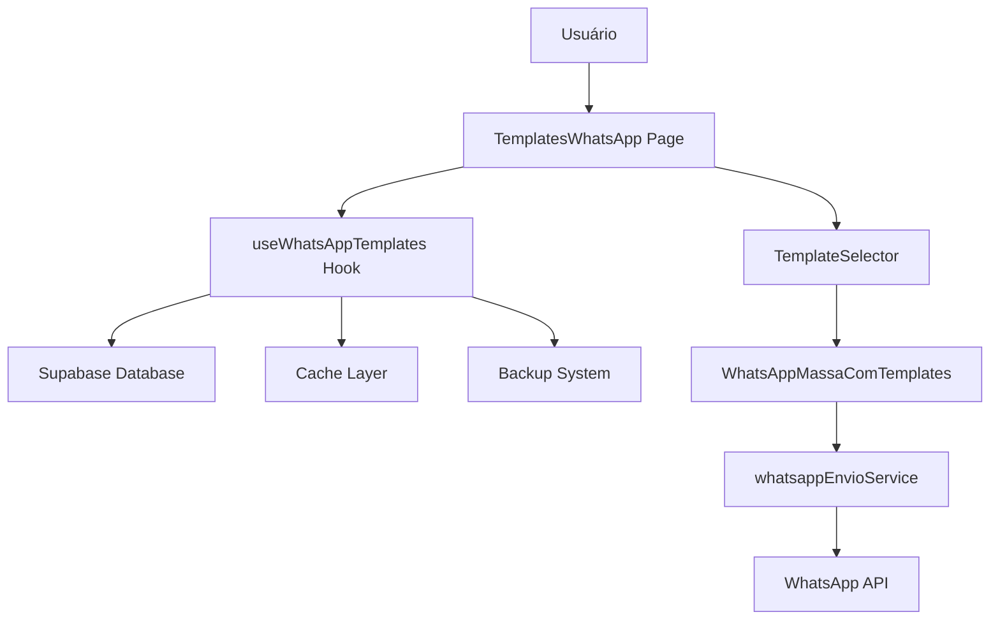

# 🔧 Documentação Técnica - Sistema de Templates WhatsApp

## 📋 Visão Geral Técnica

O sistema de Templates WhatsApp é uma solução completa para gerenciamento e envio em massa de mensagens personalizadas. Foi desenvolvido com foco em performance, escalabilidade e facilidade de manutenção.

### Tecnologias Utilizadas

- **Frontend**: React 18 + TypeScript + Vite
- **UI Components**: shadcn/ui + Tailwind CSS
- **Backend**: Supabase (PostgreSQL + Real-time)
- **Validação**: Zod
- **Estado**: React Hooks + Context API
- **Cache**: Custom cache implementation
- **Build**: Vite + Rollup

---

## 🏗️ Arquitetura do Sistema

### Estrutura de Diretórios

```
src/
├── components/
│   ├── templates-whatsapp/
│   │   ├── TemplateForm.tsx          # Formulário de templates
│   │   ├── TemplatePreview.tsx       # Preview de templates
│   │   └── TemplateSelector.tsx      # Seletor múltiplo
│   └── whatsapp/
│       └── WhatsAppMassaComTemplates.tsx  # Envio em massa
├── hooks/
│   ├── useWhatsAppTemplates.ts       # Hook principal
│   ├── useTemplateBackup.ts          # Sistema de backup
│   └── useTemplatePerformance.ts     # Otimizações
├── services/
│   ├── whatsappService.ts            # Integração WhatsApp
│   └── whatsappEnvioService.ts       # Envio em lote
├── types/
│   └── whatsapp-templates.ts         # Definições TypeScript
└── pages/
    └── TemplatesWhatsApp.tsx         # Página principal
```

### Fluxo de Dados



---

## 🗄️ Estrutura do Banco de Dados

### Tabela Principal: `whatsapp_templates`

```sql
CREATE TABLE whatsapp_templates (
  id UUID PRIMARY KEY DEFAULT gen_random_uuid(),
  nome VARCHAR(100) NOT NULL,
  categoria VARCHAR(50) NOT NULL,
  mensagem TEXT NOT NULL,
  variaveis TEXT[] DEFAULT '{}',
  ativo BOOLEAN DEFAULT true,
  created_at TIMESTAMP DEFAULT NOW(),
  updated_at TIMESTAMP DEFAULT NOW()
);
```

### Tabela de Backup: `whatsapp_templates_backup`

```sql
CREATE TABLE whatsapp_templates_backup (
  id UUID PRIMARY KEY DEFAULT gen_random_uuid(),
  template_id UUID NOT NULL,
  template_data JSONB NOT NULL,
  operacao VARCHAR(20) NOT NULL, -- 'create', 'update', 'delete'
  usuario_id UUID,
  created_at TIMESTAMP DEFAULT NOW()
);
```

### Índices para Performance

```sql
-- Índices principais
CREATE INDEX idx_whatsapp_templates_categoria ON whatsapp_templates(categoria);
CREATE INDEX idx_whatsapp_templates_ativo ON whatsapp_templates(ativo);
CREATE INDEX idx_whatsapp_templates_nome ON whatsapp_templates(nome);

-- Índices de backup
CREATE INDEX idx_backup_template_id ON whatsapp_templates_backup(template_id);
CREATE INDEX idx_backup_operacao ON whatsapp_templates_backup(operacao);
CREATE INDEX idx_backup_created_at ON whatsapp_templates_backup(created_at);
```

---

## 🔧 Componentes Principais

### 1. useWhatsAppTemplates Hook

Hook principal que gerencia todo o CRUD de templates.

```typescript
interface UseWhatsAppTemplatesReturn {
  // Estados
  templates: WhatsAppTemplate[];
  loading: boolean;
  error: string | null;
  
  // CRUD Operations
  createTemplate: (data: CreateTemplateData) => Promise<WhatsAppTemplate>;
  updateTemplate: (data: UpdateTemplateData) => Promise<WhatsAppTemplate>;
  deleteTemplate: (id: string) => Promise<void>;
  
  // Processamento
  previewTemplate: (template: WhatsAppTemplate) => PreviewResult;
  processTemplate: (template: WhatsAppTemplate, viagem: ViagemData, passageiro: PassageiroData) => string;
}
```

### 2. TemplateSelector Component

Componente para seleção múltipla de templates com preview.

**Props:**
```typescript
interface TemplateSelectorProps {
  viagem?: Partial<ViagemData>;
  passageiro?: Partial<PassageiroData>;
  onSelectionChange: (selectedTemplates: SelectedTemplate[]) => void;
  selectedTemplates?: SelectedTemplate[];
  showPreview?: boolean;
}
```

**Funcionalidades:**
- Seleção múltipla com checkboxes
- Edição inline de mensagens
- Preview automático com dados reais
- Filtros por categoria e busca
- Agrupamento por categoria

### 3. WhatsAppEnvioService

Serviço para envio em lote com controle de rate limiting.

```typescript
class WhatsAppEnvioService {
  async enviarLote(
    dados: EnvioMensagemData,
    onProgress?: (progresso: ProgressoEnvio) => void
  ): Promise<ResumoEnvio>
  
  cancelarEnvio(): void
  validarDados(dados: EnvioMensagemData): { valido: boolean; erros: string[] }
}
```

**Configurações:**
- `delayEntreMensagens`: 2000ms (padrão)
- `maxTentativas`: 3 (padrão)
- `timeoutMensagem`: 10000ms (padrão)

---

## 🚀 Sistema de Performance

### Cache Implementation

```typescript
class TemplateCache {
  private cache = new Map<string, CacheEntry<any>>();
  private readonly defaultTTL = 5 * 60 * 1000; // 5 minutos
  
  set<T>(key: string, data: T, ttl?: number): void
  get<T>(key: string): T | null
  clear(): void
  cleanup(): void // Remove entradas expiradas
}
```

### Otimizações Implementadas

1. **Debounce**: Busca com delay de 300ms
2. **Memoização**: Templates filtrados e agrupados
3. **Cache**: Resultados de filtros com TTL
4. **Virtual Scrolling**: Para listas grandes
5. **Lazy Loading**: Componentes carregados sob demanda

### Métricas de Performance

```typescript
interface PerformanceMetrics {
  searchTime: number;      // Tempo de busca em ms
  renderTime: number;      // Tempo de renderização em ms
  cacheHits: number;       // Acertos no cache
  cacheMisses: number;     // Falhas no cache
}
```

---

## 🔄 Sistema de Backup

### Backup Automático

Todos os templates são automaticamente salvos em backup quando:
- Criados (`operacao: 'create'`)
- Atualizados (`operacao: 'update'`)
- Excluídos (`operacao: 'delete'`)

### Recuperação de Templates

```typescript
const recuperarTemplate = async (backup: TemplateBackup): Promise<WhatsAppTemplate | null> => {
  // Verifica se template já existe
  // Restaura dados originais
  // Cria novo backup da recuperação
  // Retorna template restaurado
}
```

### Export/Import

- **Export**: Gera arquivo JSON com todos os templates
- **Import**: Valida e importa templates de arquivo JSON
- **Formato**: JSON estruturado com validação de schema

---

## 🔌 Integração com WhatsApp

### Estrutura de Envio

```typescript
interface EnvioMensagemData {
  templates: SelectedTemplate[];
  passageiros: PassageiroData[];
  viagem: ViagemData;
  variaveisGlobais?: Record<string, string>;
}
```

### Processamento de Variáveis

```typescript
const processarVariaveis = (
  mensagem: string,
  viagem: ViagemData,
  passageiro: PassageiroData
): string => {
  const variaveis: VariableMapping = {
    NOME: passageiro.nome,
    DESTINO: viagem.destino,
    DATA: formatDate(viagem.data_viagem),
    // ... outras variáveis
  };
  
  return substituirVariaveis(mensagem, variaveis);
}
```

### Rate Limiting

- **Delay entre mensagens**: 2 segundos (configurável)
- **Retry automático**: Até 3 tentativas
- **Backoff exponencial**: Delay crescente entre tentativas
- **Cancelamento**: Possibilidade de abortar envio

---

## 📊 Validações e Tratamento de Erros

### Validação de Templates

```typescript
const validateTemplate = (data: CreateTemplateData) => {
  const errors: string[] = [];
  
  if (!data.nome?.trim()) errors.push('Nome é obrigatório');
  if (!data.mensagem?.trim()) errors.push('Mensagem é obrigatória');
  if (data.mensagem && data.mensagem.length > 4096) {
    errors.push('Mensagem muito longa (máximo 4096 caracteres)');
  }
  
  return { valid: errors.length === 0, errors };
};
```

### Tratamento de Erros

1. **Erros de Validação**: Mostrados no formulário
2. **Erros de Rede**: Retry automático com backoff
3. **Erros de API**: Logs detalhados + mensagem amigável
4. **Erros de Envio**: Relatório individual por mensagem

---

## 🧪 Testes (Estrutura Planejada)

### Testes Unitários

```typescript
// Exemplo de teste para processamento de variáveis
describe('processTemplate', () => {
  it('should replace all variables correctly', () => {
    const template = { mensagem: 'Olá {NOME}, viagem para {DESTINO}' };
    const viagem = { destino: 'Rio de Janeiro' };
    const passageiro = { nome: 'João Silva' };
    
    const result = processTemplate(template, viagem, passageiro);
    expect(result).toBe('Olá João Silva, viagem para Rio de Janeiro');
  });
});
```

### Testes de Integração

- Testes de CRUD com banco de dados
- Testes de envio em lote
- Testes de cache e performance
- Testes de backup e recuperação

---

## 🔧 Configuração e Deploy

### Variáveis de Ambiente

```env
VITE_SUPABASE_URL=your_supabase_url
VITE_SUPABASE_ANON_KEY=your_supabase_anon_key
VITE_WHATSAPP_API_URL=your_whatsapp_api_url
VITE_WHATSAPP_API_TOKEN=your_whatsapp_token
```

### Build e Deploy

```bash
# Desenvolvimento
npm run dev

# Build de produção
npm run build

# Preview do build
npm run preview

# Verificação de tipos
npx tsc --noEmit
```

### Configuração do Supabase

1. **RLS (Row Level Security)**: Configurado para templates
2. **Triggers**: Auto-update de `updated_at`
3. **Functions**: Limpeza automática de backups antigos
4. **Indexes**: Otimizados para queries frequentes

---

## 📈 Monitoramento e Logs

### Métricas Coletadas

- Tempo de resposta das queries
- Taxa de sucesso dos envios
- Uso do cache (hit/miss ratio)
- Erros por categoria
- Performance de renderização

### Logs Estruturados

```typescript
const logEnvio = {
  timestamp: new Date().toISOString(),
  action: 'whatsapp_envio',
  template_id: template.id,
  passageiro_id: passageiro.id,
  success: true,
  duration_ms: 1250,
  error: null
};
```

---

## 🔮 Roadmap Técnico

### Próximas Implementações

1. **WebSockets**: Updates em tempo real
2. **Service Workers**: Cache offline
3. **GraphQL**: API mais eficiente
4. **Micro-frontends**: Modularização
5. **AI Integration**: Templates inteligentes

### Melhorias de Performance

1. **Code Splitting**: Lazy loading de rotas
2. **Bundle Optimization**: Tree shaking
3. **Image Optimization**: Lazy loading de imagens
4. **CDN**: Assets estáticos
5. **Database Optimization**: Query optimization

---

## 🛠️ Troubleshooting

### Problemas Comuns

**Templates não carregam**
```typescript
// Verificar conexão com Supabase
const { data, error } = await supabase.from('whatsapp_templates').select('*');
if (error) console.error('Database error:', error);
```

**Cache não funciona**
```typescript
// Limpar cache manualmente
cacheRef.current.clear();
```

**Envio falha**
```typescript
// Verificar configuração do serviço
const config = {
  delayEntreMensagens: 3000, // Aumentar delay
  maxTentativas: 5,          // Mais tentativas
  timeoutMensagem: 15000     // Timeout maior
};
```

### Debug Mode

```typescript
// Ativar logs detalhados
localStorage.setItem('debug_templates', 'true');

// Ver métricas de performance
const metrics = getPerformanceMetrics();
console.log('Performance:', metrics);
```

---

*Documentação atualizada em: Dezembro 2024*
*Versão do sistema: 2.0*